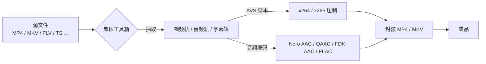

<div align="center">


# 岚珠工具箱 · LanzhuTool

**基于 .NET Framework 的 WinForms 视频处理工具箱 —— 小丸工具箱（Maruko's Toolbox）的现代化衍生版**

[](LICENSE)
[](#系统需求)
[](#系统需求)
[](#关于-legacy-分支)

</div>

> [!IMPORTANT]
> 本仓库是岚珠工具箱的 **Legacy 分支（WinForms + .NET Framework）**，属于历史归档版本，只接受维护性修复。
> 下一代实现已用 **Tauri + Rust + Web 前端** 重写，请移步 **[shengengfun/LanzhuToolNX](https://github.com/shengengfun/LanzhuToolNX)**。

## 关于 Legacy 分支

岚珠工具箱（LanzhuTool）是一款面向字幕组与压制爱好者的**批量视频处理 GUI**，派生自经典的
[小丸工具箱 / Maruko's Toolbox](https://github.com/shengengfun/marukotoolboxX)。
在保留原有工作流的前提下，本分支补充了更现代的界面外观、整理过的工具链目录结构，以及工具链自动更新等维护能力。

程序本身**不做任何编解码**，而是把一堆命令行工具编排成一条好用的流水线：



## 功能特性

| 标签页 | 说明 |
| --- | --- |
| **MediaInfo** | 展示封装格式与视频 / 音频 / 字幕轨参数（依赖 `MediaInfo.dll`） |
| **AVS** | 编辑与预览 AviSynth 脚本，可一键送入压制流程 |
| **抽取** | 从 MP4 / MKV / FLV 等容器中分离视频、音频、字幕、章节 |
| **封装** | 将视频、音频、字幕、章节重新混流为 MP4（MP4Box）或 MKV（mkvmerge） |
| **音频** | Nero AAC / QAAC / FDK-AAC / FLAC 等编码器，内置常用码率预设 |
| **视频** | x264 / x265 压制，内置 DVDRip、iOS、PSP、MAD 等预设 |
| **常用** | 高频小工具（重命名、音轨处理等） |
| **设置** | 工具路径、语言、日志、线程等选项 |
| **帮助** | 内置使用说明与常见问题 |

其他特性：

- **多语言界面**：简体中文（默认）、繁體中文、English、日本語
- **进度反馈**：任务栏进度、可暂停 / 中止的任务窗口、实时日志
- **工具链自动更新**：`update_tools.ps1` 一键升级 MP4Box / MKVToolNix，带重试、超时与可选 SHA256 校验
- **资源审计**：`audit_resx_resources.ps1` 统计并去重 `.resx` 中的二进制资源

## 系统需求

| 项目 | 要求 |
| --- | --- |
| 操作系统 | Windows 7 SP1 / 8 / 8.1 / 10 / 11（x64 系统亦可，主程序为 x86） |
| 运行时 | .NET Framework **4.8** |
| 磁盘 | 程序本体约 10 MB；`tools/` 工具链另需数百 MB |
| 构建 | Visual Studio 2013 及以上，或 .NET Framework 自带的 MSBuild |

> 旧文档提到的 Linux / Mono / Wine 运行方式**未在本分支验证**，请自行承担风险。

## 快速开始

1. Clone 或下载本仓库；
2. 准备工具链目录 `tools/`（见下一节，仓库内不含二进制）；
3. 按「从源码构建」编译，得到 `mp4box\bin\Release\lanzhutool.exe`；
4. 程序目录（`lanzhutool.exe` 所在目录）需同时包含 `Res/`、`en/`、`ja-JP/`、`zh-Hant/` 与 `tools/`，可直接把 `bin\Release` 整个目录拿来用。

## 工具链（`tools/`）

`tools/`、`_sdk/`、`xiaowan/` 体积过大且涉及第三方许可，**不纳入版本库**，需自行获取。
推荐目录约定：

```
tools/
├─ video/ffmpeg/          ffmpeg.exe
├─ video/gpac/            MP4Box.exe
├─ video/mkvtoolnix/      mkvmerge.exe, mkvextract.exe, mkvinfo.exe
├─ video/flv/             FLVExtractCL.exe, FlvBind.exe
├─ audio/encoders/        neroAacEnc.exe, qaac.exe, fdkaac.exe, flac.exe
├─ runtime/common/        通用运行库
├─ qtfiles/               qaac 运行依赖
├─ avs/                   AviSynth 及插件
└─ x64/                   x64 组件（如 x64 版 MediaInfo.dll）
```

维护脚本：

```powershell
.\update_tools.ps1 -RetryCount 3 -TimeoutSec 120   # 更新 MP4Box、MKVToolNix
.\audit_resx_resources.ps1                         # 审计 .resx 二进制资源

cd .\tools
.\organize_tools.ps1            # 预览整理方案（DRY-RUN）
.\organize_tools.ps1 -Apply     # 实际整理并生成 toolchain_ver.txt
```

详见 [`TOOLS_UPDATE_GUIDE.md`](TOOLS_UPDATE_GUIDE.md) 与 [`tools/TOOLS_MANIFEST.md`](tools/TOOLS_MANIFEST.md)。

## 从源码构建

```powershell
# 旧式项目 + COM 引用，推荐用 .NET Framework 自带的 MSBuild
& "C:\Windows\Microsoft.NET\Framework64\v4.0.30319\MSBuild.exe" .\mp4box.sln `
    /t:Build /p:Configuration=Release /p:Platform=x86
```

产物：`mp4box\bin\Release\lanzhutool.exe`

解决方案包含两个项目：

| 项目 | 说明 |
| --- | --- |
| `mp4box` | 主程序（WinForms，输出 `lanzhutool.exe`，x86） |
| `ControlExs` | 自绘控件库（窗体基类、扁平按钮、消息框等） |

## 目录结构

```
.
├─ mp4box/                 主程序源码（WinForms）
│  ├─ MainForm.*           主界面（9 个标签页）
│  ├─ PreviewForm.*        预览窗口
│  ├─ WorkingForm.*        任务执行 / 进度窗口
│  ├─ FormUpdater.*        自动更新
│  ├─ Supplements.cs       界面增强与杂项逻辑
│  ├─ Program.cs           入口（注入 tools 目录到 PATH、设置 DLL 搜索路径）
│  └─ Res/                 图标、启动图、内置脚本
├─ ControlExs/             自绘控件库
├─ preset.xml              编码预设（x264 / x265 / NeroAAC / FDKAAC / QAAC）
├─ update_tools.ps1        工具链更新脚本
├─ audit_resx_resources.ps1
├─ TOOLS_UPDATE_GUIDE.md
└─ mp4box.sln
```

## 与上游的关系

本分支源自 **小丸工具箱 / Maruko's Toolbox**（Apache-2.0）：

| | |
| --- | --- |
| 上游作者 | komaruchan \<sandy_0308@hotmail.com\>、LunarShaddow \<aflyhorse@hotmail.com\> |
| 上游主页 | <http://www.maruko.in/>（原 CodePlex 项目已下线） |

在原有功能之上，本分支主要补充了：

- 工具链目录整理（`tools/` 分类存放）与**自动更新**脚本；
- 更现代的图标 / 启动画面与界面外观；
- Windows 文件名 Unicode（日文、异体字）兼容性修复（v1.0.2）；
- `.resx` 资源审计、解决方案 x86 配置映射等构建期维护能力。

## 致谢与贡献者

- **[小丸](http://www.maruko.in/)** —— [小丸工具箱] 原作者 komaruchan、LunarShaddow，本项目的起点
- **[shengengfun](https://github.com/shengengfun)** —— 本项目维护
- **DeepSeek** —— AI 编程助手，参与了界面现代化、工具链整理与文档编写
- **GitHub Copilot** —— AI 编程助手，参与了文档与维护脚本

欢迎提 Issue / PR。

## 许可证

本项目以 [Apache License 2.0](LICENSE) 发布。
`tools/` 目录下由第三方提供的可执行文件、运行库与字体等，**各自遵循其原始许可证**，本项目不为其分发与再分发负责。
